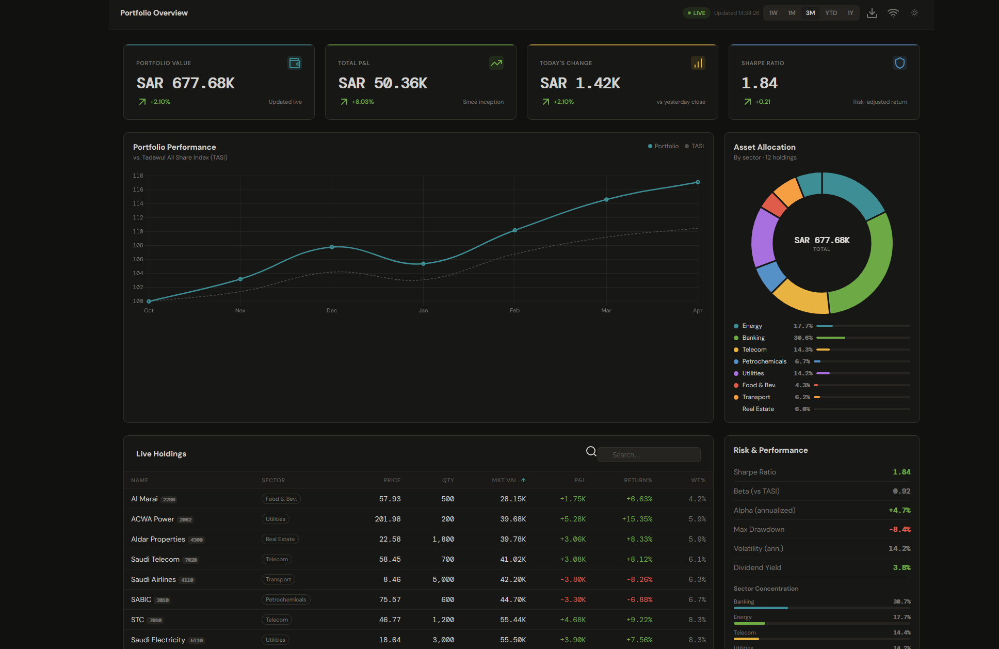

# PortfolioIQ
Professional portfolio tracker for Saudi Tadawul stocks. Live prices via Alpha Vantage API, TASI benchmark comparison, advanced risk metrics (Sharpe, Beta, Alpha), Monte Carlo simulation (1K scenarios), Markowitz optimizer. HTML/CSS/JS + Chart.js. Transaction history, CSV export, dark/light mode, fully responsive.

# PortfolioIQ — Investment Analytics Dashboard

Professional portfolio analytics dashboard for Saudi Tadawul equities featuring live pricing, advanced risk analytics, and portfolio optimization.

## ✨ **Key Features**

| Feature | Description |
|---------|-------------|
| **Live Prices** | Alpha Vantage API integration (SAR 2222.SR, 1120.SR, etc.) |
| **Performance** | Indexed returns vs TASI benchmark |
| **Risk Analytics** | Sharpe Ratio, Beta, Alpha, Max Drawdown, Volatility |
| **Monte Carlo** | 1,000 scenarios projecting 1-year portfolio outcomes |
| **Optimizer** | Markowitz Modern Portfolio Theory weights |
| **Transactions** | Buy/sell tracking with commission calculator |
| **Export** | Holdings & transactions CSV download |

# Live demo
https://htmlpreview.github.io/?https://raw.githubusercontent.com/khalidalenzi-official/portfolio-dashboard/main/index.html
